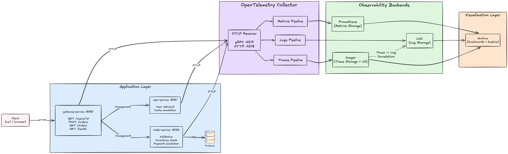

# TraceForge

TraceForge is a cloud-native observability playground built with **Go**, **OpenTelemetry**, **Grafana**, **Loki**, **Jaeger**, **Prometheus**, and **PostgreSQL**.

The project demonstrates how telemetry flows through a modern distributed system from instrumented microservices, through the OpenTelemetry Collector, into dedicated storage backends for **traces**, **metrics**, and **logs**. It focuses on practical observability concepts such as trace propagation, telemetry correlation, structured logging, custom metrics, and collector pipelines.

Designed as a hands-on learning project, TraceForge provides a realistic reference architecture that mirrors production observability stacks while remaining simple enough to run locally with Docker Compose.

---

## Architecture



---

## Tech Stack

| Tool | Role |
|------|------|
|  | Microservices |
|  | Instrumentation and signal export (traces, metrics, logs) |
|  | Telemetry pipeline — receives OTLP, routes to backends |
|  | Distributed trace storage and waterfall UI |
|  | Metrics scraping, storage, and PromQL engine |
|  | Log aggregation backend |
|  | Dashboards, Explore, and cross-signal linking |
|  | Persistent order storage |
|  | Local orchestration |

---

## System Components

### Application Services

| Service | Port | Role |
|---------|------|------|
| `gateway-service` | 8080 | Public entry point. Validates requests, fans out to user-service and order-service, propagates `traceparent`. |
| `user-service` | 8081 | Internal user lookup. In-memory store. Simulates a 200 ms cache miss for user ID 2. |
| `order-service` | 8082 | Creates orders in PostgreSQL. Four pipeline stages: validate → inventory check → payment → DB insert. |

Each service:
- Instruments every handler with **OTel spans** (manual + `otelhttp` middleware)
- Exports **custom metrics** via the OTel Prometheus exporter (counter + histogram per service)
- Emits **structured JSON logs** with `trace_id` and `span_id` injected from the active OTel span

### OTel Collector

Central telemetry gateway. Receives OTLP from all three services and fans signals out to three independent pipelines:

| Pipeline | Receiver | Exporter |
|----------|----------|----------|
| Traces | OTLP :4317/:4318 | Jaeger |
| Metrics | OTLP :4317/:4318 | Prometheus scrape endpoint :8889 |
| Logs | OTLP :4317/:4318 | Loki HTTP push |

Config: `collector/config.yaml`

### PostgreSQL

Persistent store for orders. Initialised from `db/init.sql` on first start — creates the `users` and `orders` tables and seeds five users (IDs 1–5) that mirror the user-service in-memory store.

### Observability Backends

| Backend | URL | Purpose |
|---------|-----|---------|
| **Jaeger** | http://localhost:16686 | Distributed trace waterfall view |
| **Prometheus** | http://localhost:9090 | Metrics storage and PromQL query engine |
| **Loki** | http://localhost:3100 | Log aggregation backend (API only) |
| **Grafana** | http://localhost:3000 | Dashboards, Explore (logs + traces), cross-signal linking |

---

## Quick Start

```bash
docker compose up --build
```

Wait until all services show `healthy`, then open the UIs:

| UI | URL | Credentials |
|----|-----|-------------|
| Grafana | http://localhost:3000 | admin / admin |
| Jaeger | http://localhost:16686 | — |
| Prometheus | http://localhost:9090 | — |

---

## Observability Walkthrough

Once the stack is running and you've sent a few requests, here's how to navigate the three pillars and follow a single request end-to-end.

1. **Traces — Jaeger**
Open Jaeger and select `gateway-service`. Find any `POST /orders` trace and open the waterfall. You'll see all nine spans across three processes in a single view — each child span indented under its parent, with durations shown as bars. Click a span to inspect its attributes (DB statement, payment auth code, error message).

2. **Logs — Grafana Explore**
Switch to Grafana Explore with the Loki datasource. Query `{job="order-service"}` to stream structured logs from the order pipeline. Each log line carries a `trace_id` field — click the **View in Jaeger** link next to it to jump directly to the matching waterfall.

3. **Metrics — Grafana Dashboard**
Open the **TraceForge — Platform Overview** dashboard. It covers the RED method: request rate by endpoint, error rate by failure reason, and P50/P95/P99 latency for the gateway and database. Trigger the burst `curl` loop from the Quick Start to watch the graphs populate in real time.

4. **Cross-signal navigation**
The full loop: a Jaeger span links to its Loki logs, a Loki log line links back to the trace, and the dashboard shows aggregate health for the same time window. All three signals share the same `trace_id`.
